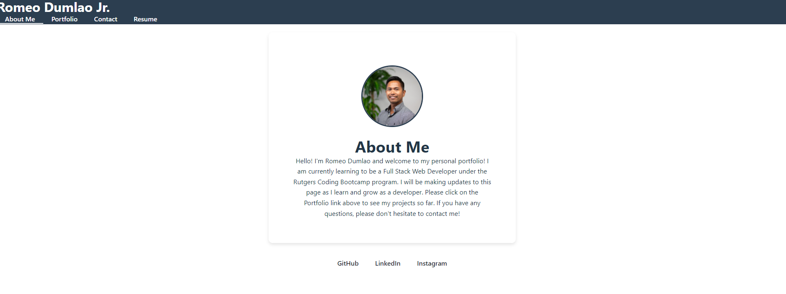

# Portfolio - REACT

## Description

This is a React-based personal portfolio web application, designed to showcase web development projects, skills, and professional information. Built using Vite and React, it offers a modern, responsive design.

## Features
- **Responsive Design**: Ensures optimal viewing experience across various devices and screen sizes.
- **Interactive Project Showcase**: Displays web development projects with options to view details, live demos, and source code.
- **Dynamic Routing**: Implemented using `react-router-dom` for seamless navigation without page reloads.
- **Form Validation**: Contact form with client-side validation for user inputs.

## Getting Started

### Prerequisites

- Node.js
- npm

## Installation
To install the application, follow these steps:
1. Clone the repository to your local machine.
2. Navigate to the project directory in your terminal.
3. Run `npm install` to install all dependencies.
4. Run `npm start` to start the application.

## Usage

The personal portfolio web application is designed to showcase a collection of web development projects and professional information. Here's how to navigate and use the application:

* Home Page: Features an introduction and a brief overview of what to expect on the site.
* About Me: Learn more about me, my background, skills, and interests.
* Portfolio: Browse through my development projects. Click on any project to see a detailed view, including technologies used and project objectives. Some projects include links to live demos and GitHub repositories.
* Contact: If you have any questions or wish to reach out to me, use the contact form. Simply fill in your name, email, and message, and click 'Send'. The form validates your input to ensure that all necessary fields are filled out correctly.
* Responsive Design: The website is designed to be responsive, meaning it will adjust its layout and content to fit the screen size of various devices, from desktops to mobile phones.

## Screenshots

## Deployed Application
https://tiny-selkie-6faaa1.netlify.app/

## Contributing
Please contact me at:
`GitHub: github.com/romeocd`
`Email: rdumlao07@gmail.com`

## License
MIT